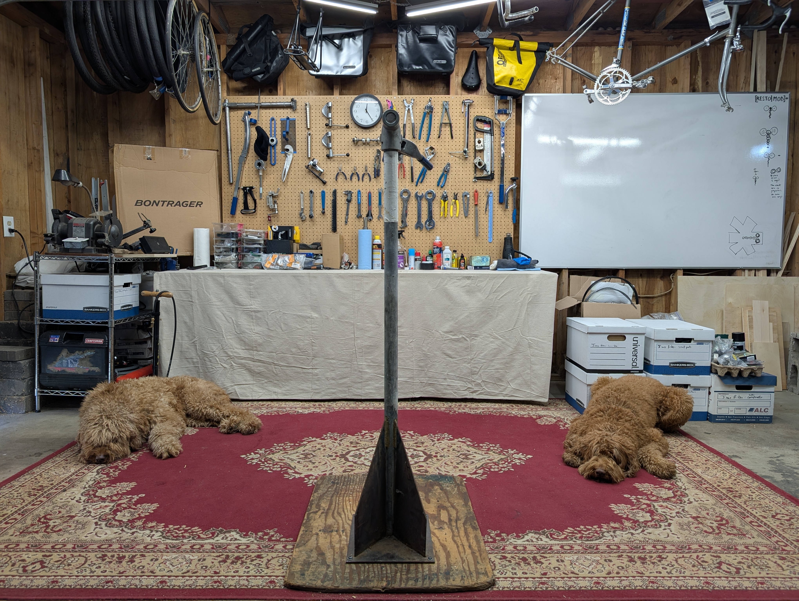

Our Cascadia based workshop is where the magic happens.

Machine beauty is the happy marriage of power and simplicity. All
our bikes strive for machine beauty.

We source high-quality rigid cromoly frames from the 80s and 90s — the
golden era of rigid mountain bikes — and either restore then to original
with minimal updates, or restomod them with modern
components that prioritize comfort, reliability, and a "delicious" ride
quality. 

## Two build aesthetics

Aesthetically we go for two styles: derelicts or pretty works of bike mechanical art.
Either way the machine has to be mechanically dialed in.

For the derelict look (a term from the automotive restomodders) we
keep the patina to build wolf in sheeps clothing that do not need to
worry about the bike theives while out having fun.

If we go for pretty then it can get into a rathole obsession while
reaching for a work of mechanical art, but then that why we got 
involved in all this.

