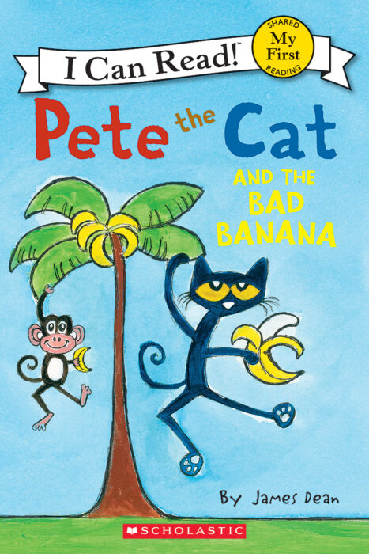

The Cheap Bike Build-Off has become an annual event. For 2025, we built
the Bad Banana, named after the children's book, Pete the Cat and the Bad Banana.

The Build-Off is simple

/builds/

The rules were simple: build a complete, rideable bicycle for as little money as possible. The result had to actually function — it had to shift, brake, roll, and survive a real ride. That's it.

We named ours the Bad Banana before we even started wrenching.

## The Ride

The Bad Banana rides. That is the claim and that is the truth. It shifts through all gears with only mild protest in the lowest two. It brakes with conviction. It rolls on 26-inch wheels that are approximately round.

We rode it to the Tacoma Dome and back. We locked it to a lamp post outside a coffee shop in Belltown and it was still there when we came out. It has been photographed in at least six locations around the city without any planning.

## The Point

The Cheap Bike Build-Off is not about building bad bikes. It's about demonstrating that quality of ride is not exclusively a function of money spent. The Bad Banana is proof. It's for sale in the shop right now at $125 — the exact cost of its parts — because that felt right.

Take it. Ride it everywhere. Don't worry about it.
