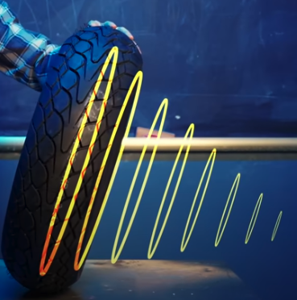
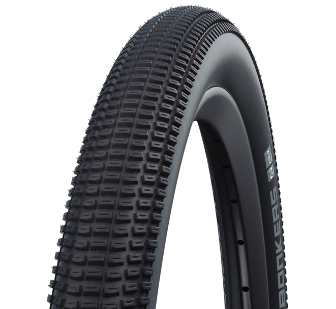
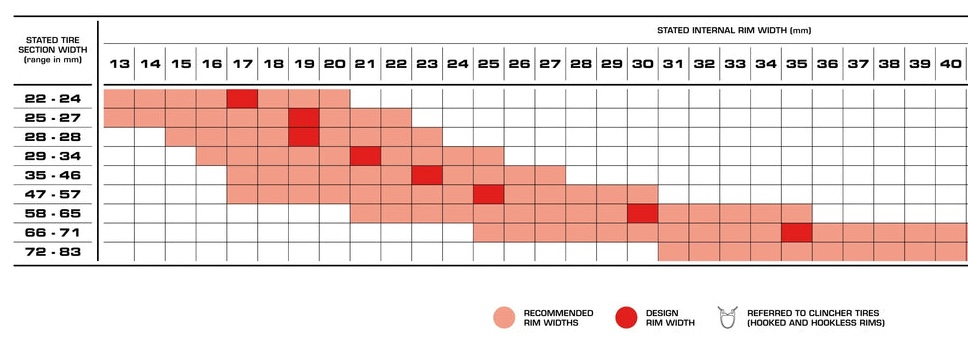
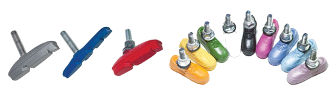
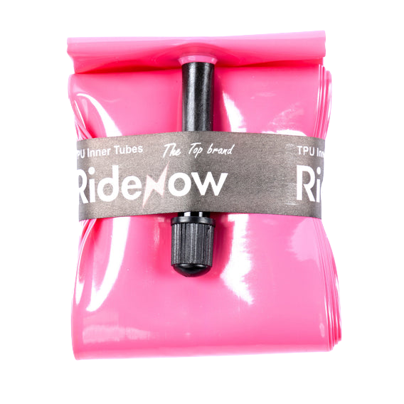
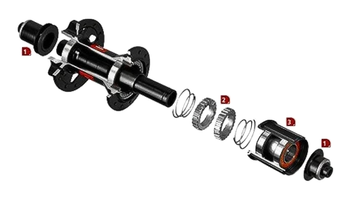
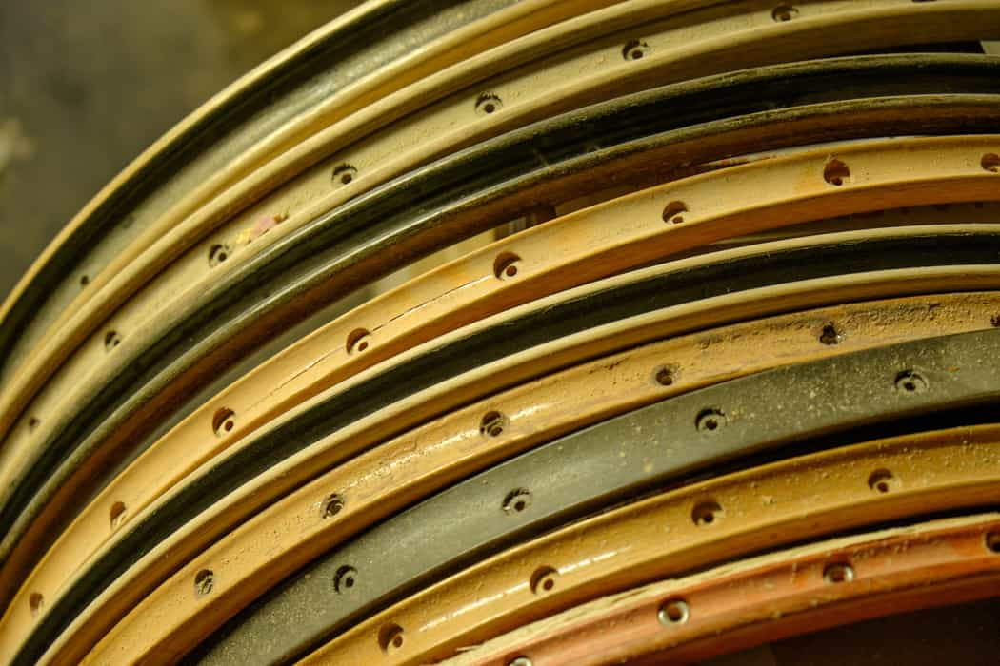
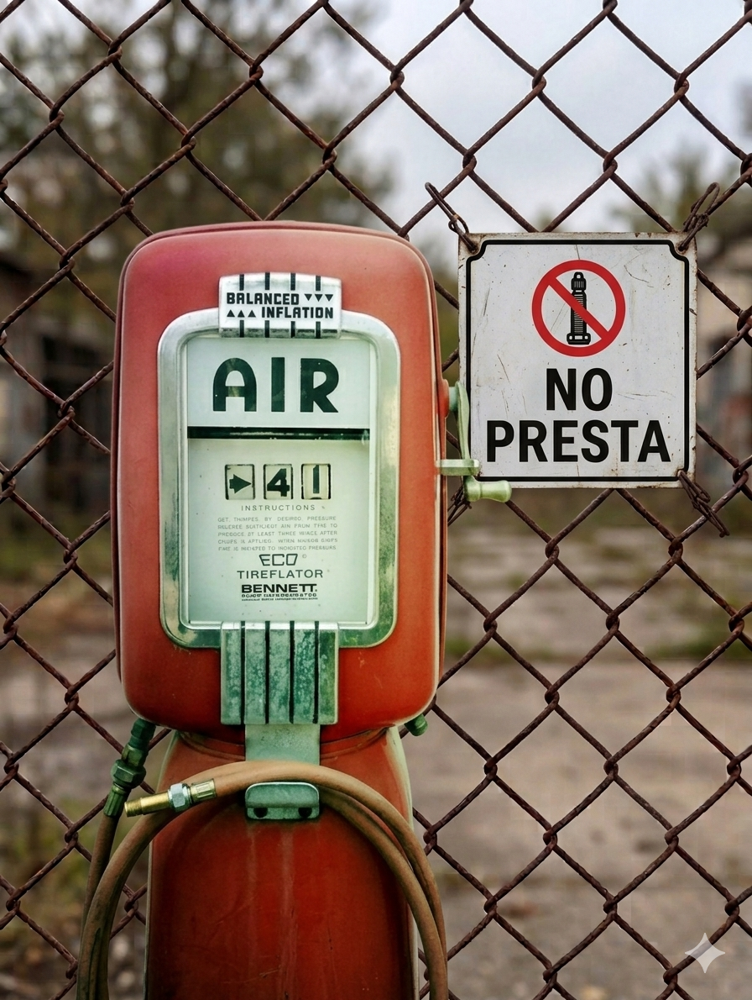

## Schwalbe balloonbike tires

Schwalbe is one of the best bicycle tire companies. It is a German company with global manufacturing (and [German pronunciation](https://www.youtube.com/watch?v=gypd1fLDCCM)).
They are one of the best manufactures of 26" tires. 26" wheels are what comes on the '90s MTB style
frames that Bicyclious focuses on.

Schwalbe as has running with the concept of
[balloonbikes](https://www.schwalbetires.com/technology-faq/balloonbike/)
that they have been making tires for since 2001 (although, the term
was [already in use in the 1980 MTB scene](https://youtu.be/DDUe9BFPrzg?t=71):

> ~We define a balloonbike as an everyday or touring bicycle with
  particularly large volume tires. With tires widths between 50 and 60
  mm it is possible to build a very comfortable bicycle without
  elaborate suspension technology. The voluminous air cushion of the
  tires is used as natural suspension. 
>
> With approximately 2 bar a balloonbike
  rolls wonderfully easily and with a full suspension effect. A standard
  tire at a width of 37 mm must be inflated hard to 4 bar to achieve a
  comparably good rolling performance.

    
  <table>
    <thead>
      <tr>
        <th>Name</th>
        <th align="right">MSRP (USD)</th>
        <th align="right">Weight</th>
        <th>Tire Size</th>
      </tr>
    </thead>
    <tbody>
      <tr>
        <td><a href="https://www.schwalbetires.com/Big-Apple">Big Apple</a></td>
        <td align="right">$25.00</td>
        <td align="right">780 g</td>
        <td>26x2.35 (60-559)</td>
      </tr>
      <tr>
        <td><a href="https://www.schwalbetires.com/Fat-Frank">Fat Franks</a></td>
        <td align="right">$38.00</td>
        <td align="right">815 g</td>
        <td>26x2.35 (60-559)</td>
      </tr>
      <tr>
        <td><a href="https://www.schwalbetires.com/Billy-Bonkers-11654386">Billy Bonkers</a></td>
        <td align="right">$54.00</td>
        <td align="right">615 g</td>
        <td>26x2.25 (57-559)</td>
      </tr>
      <tr>
        <td><a href="https://www.schwalbetires.com/Big-Apple-11100684">Big Apple (Performance Line)</a></td>
        <td align="right">$55.00</td>
        <td align="right">898 g</td>
        <td>26x2.35 (60-559)</td>
      </tr>
      <tr>
        <td><a href="https://www.schwalbetires.com/MOTION-Big-Apple-11159660">Motion Big Apple</a></td>
        <td align="right">$55.00</td>
        <td align="right">745 g</td>
        <td>26x2.35 (60-559)</td>
      </tr>
      <tr>
        <td><a href="https://www.schwalbetires.com/Big-Ben-Plus-11101123">Big Ben Plus</a></td>
        <td align="right">$54.00</td>
        <td align="right">925 g</td>
        <td>26x2.15 (55-559)</td>
      </tr>
    </tbody>
  </table>

## Wire rims

Another thing they hadn't yet optimized in the 1990s was wheel rim
internal width (IRW).  Rims were aound 17mm to 20mm. This works with
2.35" (60mm) tires is too narrow for optimal ride characteristics.

Nowasays there are new 26" rims on the market that work will with 55mm to 60mm tires.
- 25mm internal is widely available and nice.
- 30mm is also available and best for balloon tires

A brand new set of wheel with 30mm IRW (tubeless ready) rims
can be built and shipped to homes for less than $300 by [Bicycle Wheel
Warehouse](https://bicyclewheelwarehouse.com/product/sta-tru-tr30-tubeless-v-brake-wheel-set/].

Another nice detail is if the rim has a wear indicator.

## Brake pads

We love rim brake bikes at Bicyclious. The brake pads are not
echnically part of the wheel, but they do imtimately affect the
wheels.

touch the wheel rims.  So part of the deliciousness of nice wheels is
good brake pads. Our go to for brake pads is [Kool
Stop](https://koolstop.com/collections/rim-pads) because they are
excellent pads that come in various shapes, multiple [stopping power
compounds](https://koolstop.com/pages/brake-pad-compound-description),
and also come in various colors if one wants to add a bit of flair.

## TPU inner tubes are cheap now

TPU inner tubes are lighter and have slightly nicer ride feel than the
standard butyl tubes. Note: butyl works perfectly fine (easier to
patch as well) compared to TPU but if weight can be saved as very
little addtional cost, yes, please. After 2020 the prices for TPU
inner tubes start to drop hard and there are now multiple good cheap
products to purchase. That market is still settling in terms of 
finding the sweet spot of price versus value. Looks for metal valve
stemps and look into good TPU patches.

## The modern star ratchet freehub

This is excellent 1994 technology the patent for which
[expired](https://www.showdaily.net/2022/07/kt-taiwan-perfects-ratchet-drive-freehub-manufacturing/)
in 2020 and so there are and will continue to be many suppliers of this free hub design.

It is also much simpler than earier desigsn requiring special tools to service and involves many
small pieces. Those older designs are perfectly fine to run though. But simple is delicious.

And to close, there is one last bit of tastiness that is very nice but the price does go up.
That is silent hubs. 

## Ignore Presta valves

Presta is 1800s technology that was adopted in bycycles becase the
Prest valve stem is narrower than the Schrader one. As such
undesirably narrow rims could be even narrower. Aluminum rims didn't
show up [until
1934](https://roadbikeaction.com/rolling-on-wheels-of-wood/) so
drilling a smaller hole (6mm versus 8mm) in a narrow wood rim was
valuable. Before that most rims were wood. Presta was a good choice in
that context.

Presta valves can also handle higher pressure better than Schrader.
(Presta up to 120+ PSI versus typically ~60 to 80 PSI for Schrader.
Now that we're not trying to inflate 23mm to 100 PSI, there's no
benefit on that front either.

Now that just about every discipline and niche of the bicycling world
has gotton over a foolish obsession with narrow rims, the only place
where 23mm tires are a good choice is inside a velodrome or on brand
new road networks in, say, Dubia. Everyone else benefits in terms of
speed and comfort by running wider tires. To maximize ride performance
and feel on wider tires requires wider rims, so cutting a 2mm narrower
hole is irrelevant in terms of rim strength.

So, then why run Presta? The automotive air pumps one might run into
don't work with Presta. That's not going to be tasty.

