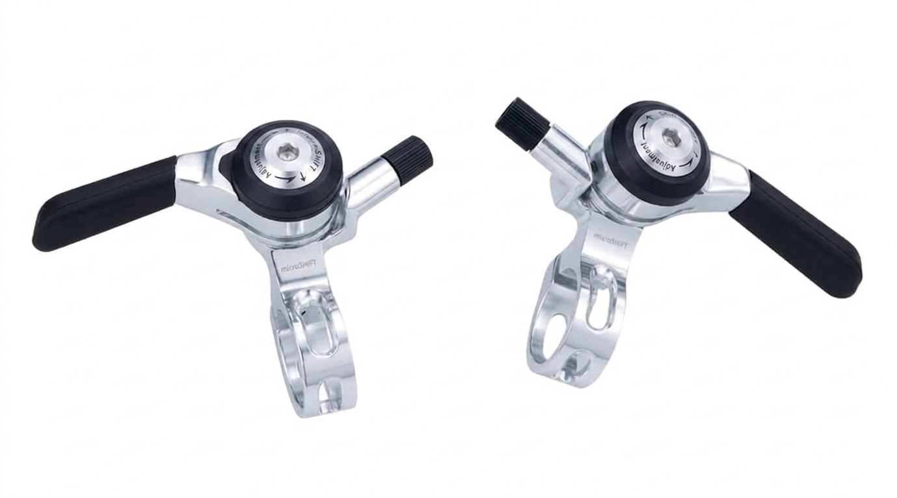
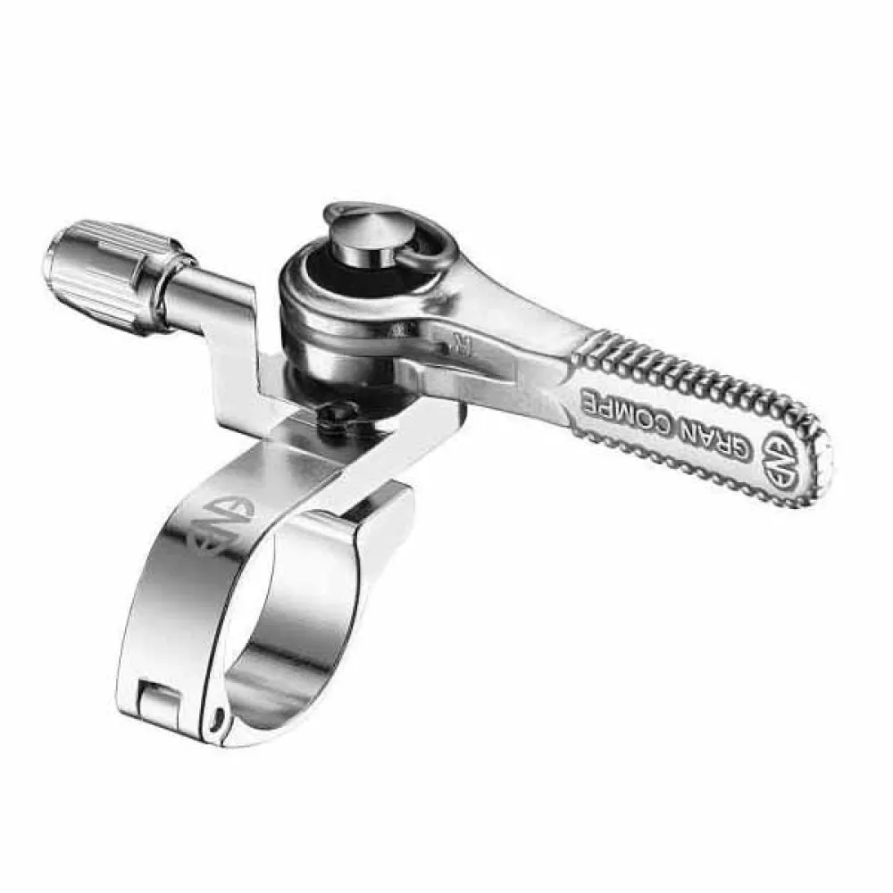

Here's a modern Microshift 3x10 thumbie pair for about $100.

Trigger shifters are nice enough, but we love us some thumbies at
Bicyclious. They were the original shifters for mountain bikes. They
are scrumptious! Some folks even [put thumbies on drop bars](https://www.somafab.com/shop/56167-ird-power-ratchet-brake-levers-uno-shimano-compatible-8919).

Thumbies are simple and effective, durable for
decades, unlike trigger shifters which gum up over the years so
degrade annoyingly. 

Trigger shifters are a pain in the ass to restore. To do the job well
requires an ultrasonic cleaner (which we do have) meaning they do not
qualify as delicious for the DIYer. Restoring thumbies is a simple
overhaul that requires no special tools nor machines, just cleaner and
new grease.

## Friction thumbies

Friction thumbies were all there was before indexing thumbies came along.
Basically, just old school downtube shifters mounted on handlebars. Very
simple and elegant.

- All the control smarts are in the rider's brain.
- Analogous to stick shifting an automobile manual transmission 

Some OG thumbies have a switch for going between indexed and
friction. The above Microshifts have that feature. It's good for
failover if indexing gets wonky on a ride and out without tools.  Or
what's wrong with just liking raw friction? That never gets wonky out
of indexing.

## Modern thumbies

Many older tumbies have limited shifting range, maxing out at eight gears or less. Some [moderns go to 12](https://www.merrysales.com/shop/category/brands-ene-ciclo-125).

Commercially, new thumbies are available. The above Silvers are Revendell excellent repro's of classic Suntour thumbies. 

The ones at the top of this page are from Microshift, very good. About $100 a pair, max 10 gear rear. These had the red caps decolored, no red.

Some available thumbies:
- Really low end but they work
  - SunRace SPORTLIMIT SLM10 Friction Shifter Set
  - Best of the low end is [the Falcon](https://velo-orange.com/products/falcon-friction-thumb-shifters) available at Velo Orange. Totally function. Acceptable if meh aestetics. Sweet deal at $15 a pair.
- ~$100 [Microshift Thumb Shifters (2/3 x 8 Speed)](https://www.performancebike.com/microshift-thumb-shifters-silver-pair-2-3-x-8-speed-sl-t08/p1357241)
- Friction classics
  - $80/ea [Dia Compe ENE Thumb Right Shifter](https://www.tradeinn.com/bikeinn/en/dia-compe-ene-thumb-right-shifter/141694343/p)
- ~$200 [Rivendell's Silver Thumbies](https://www.rivbike.com/products/kjalgjoihjga44451)
  - Note, Silver shifters need to be [mounted on something](ttps://www.rivbike.com/collections/shifting)
- Note, sometimes mounts come separates. [Paul's are bling](https://www.paulcomp.com/shop/components/drivetrain/shifting/shimanothumbies/)

## OG thubmies

If going for Shimano XT level gets a solid cast aluminum base, better than stamped steel baseplate.

.

## Underbar thumbies

-[Under bar set-up for thumbies](https://youtu.be/EfLQpdfkw8s)
