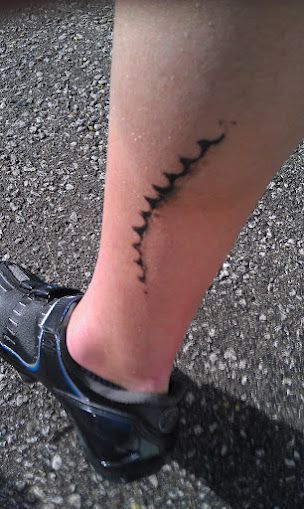

**TL;dr:**  
The #1 reason to get waxed is the savings in dollars and heartache of
clothing not ruined by black grease chainring permanant
stains. Cleaner all around. Hard to get off skin too.

So just think of your favorite clothing and add that perma-stain.

Personally, we use both wax and oil separately on different bicycles. For
the local transport rides wearing nice clothing, we take a waxed bike.

Mechanically, there are lots of other benefits to nerd out on. 

Maintenance (soap, water, dry,
drip on top-up) is much easier, especially if using a chain rotation
waxing service. Very eco friendly chain maintenance system.

And it's easier to keep clean and eventually water clean. Top up wax
post-wash. Rotate to your second pre-waxed chain you have ready at
hand, send the old one to your rewaxing service via post.

## Timeline
- 1880s: People have been waxing bicycle chains since the 1880s when
  the Renold bush roller chain was invented and is still the primary
  type of bicycle chain.
- [Bike mechanic states: chain wax's main benefit is cleanliness](https://youtu.be/pwdViNbR3Gc?t=74)
- 2026: 8m segment: [Big Chain now selling pre-waxed chains](https://www.youtube.com/watch?v=fI58cBLQR3w). 
  Finally, as an option from the factory rather than having to DIY
  strip factory oil and apply wax.

## Limitations

- [In wet riding conditions, wax can end out requiring more frequence top-ups that oil](https://youtu.be/pwdViNbR3Gc?t=744)

The standard slang terms for a simple, old-school pedal bicycle that
start with "P" are push bike (or pushbike) and its common
Australian/British nickname **pushie.** So...

[Put the pushie on the chainwax.](https://www.youtube.com/watch?v=i9RmWK-G0ps)

### Warning: careful with those master links

Originally, master links were to be used only once, after which they
were considered unsafe (or at least that's what the manufacturers
lawyers advised), including for KMC's MissingLink: use only
once. Eventually, [the Connex
Link](https://connexchain.com/en/connectors/detail/connex-link) came
out and it is reusable ("Available for all 12-, 11-, 10-, 9- and
8-speed chains. Colours available: black, silver and gold"). More
recently, KMC (one of the biggest bike chain makers) released
[MissingLink, reusable version](https://kmcchain.us/collections/connectors) 
which [KMC states](https://www.datocms-assets.com/104526/1773241366-kmc-consumer-booklet-2026-en-260311.pdf) 
can be reused:

> For usage please mind if you have a Non-Reusable or a Reusable MissingLink Connector.
> A Non-Reusable has to be replaced once opened a Reusable MissingLink can be opened and
> closed as many times as you want, but has to be disposed when the chain is worn. 

Individual reusable missing links are on the order of $10, while non-reusables are ~$5 each.
This still costs extremely less than replace clothing that has been
permanently marked with chain grease.

## Waxed Chain Simple Maintenance System

A low-hassle, no-oil bicycle chain system designed to keep things
clean, clothing-safe, and easy to maintain.

For even less hassle, the reusable Wippermann Connex Link [does not even require tools 
to remove the chain](https://www.youtube.com/watch?v=3QitTMtxtQg). That's a nice detail, especially for a very casual rider.

### At-home maintenance (occasional)

- Wash the chain with soap and water  
- Let it dry completely  
- Apply a drip wax top-up  
- Wipe off excess  
- Ride normally  

### Chain rotation (about every ~500 miles)

- Remove the chain from the bike  
- Install a freshly waxed chain  
- Place the used chain in a bag  
- Send it for cleaning and re-waxing when convenient  
- Repeat the cycle  

### Core idea

- No oil, ever  
- No daily lubrication  
- Clean, dry drivetrain interaction  
- Maintenance is split into:
  - light at-home refresh
  - occasional chain swap + service cycle  

